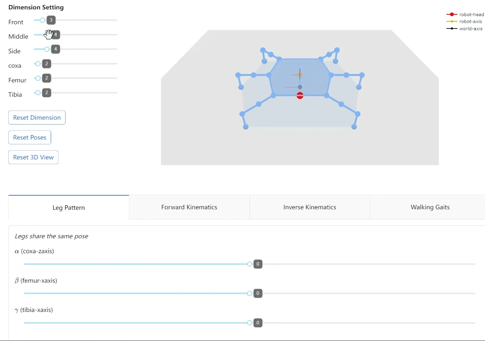
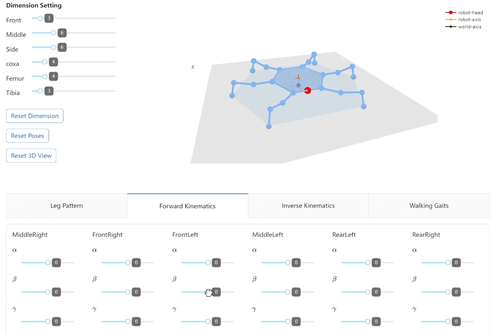
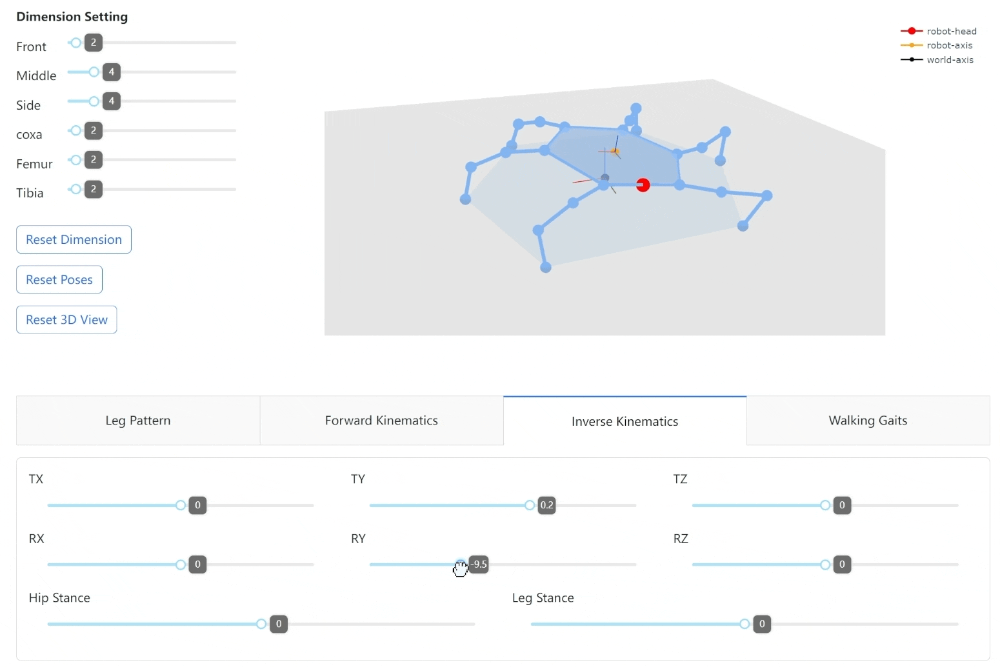
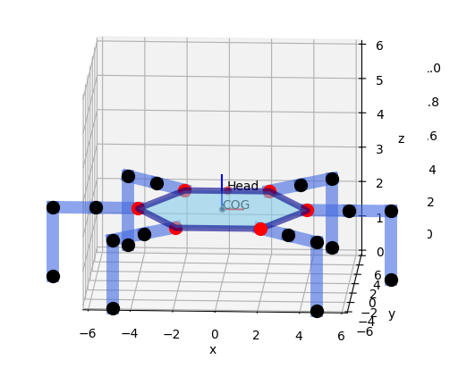
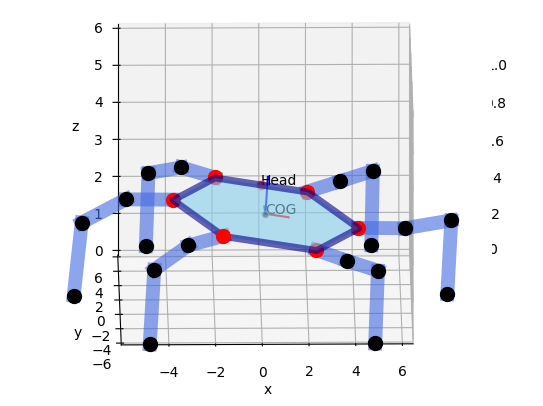
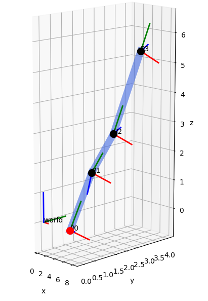
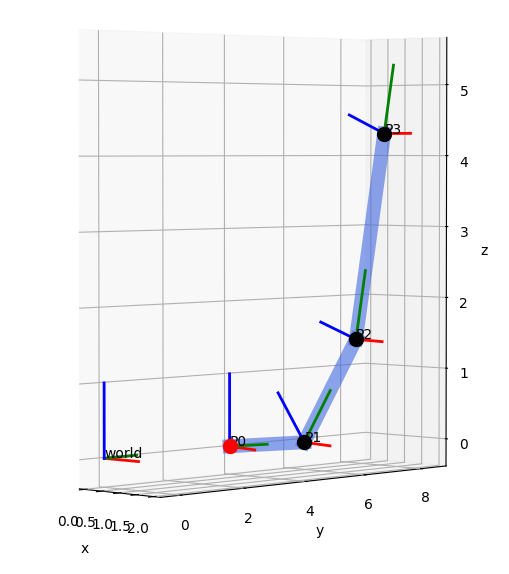
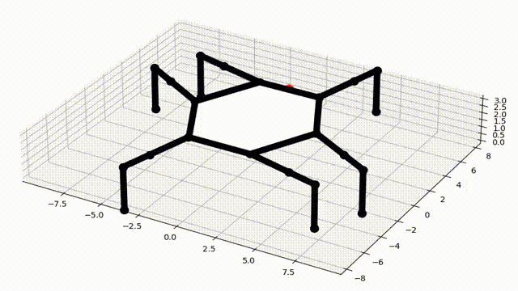
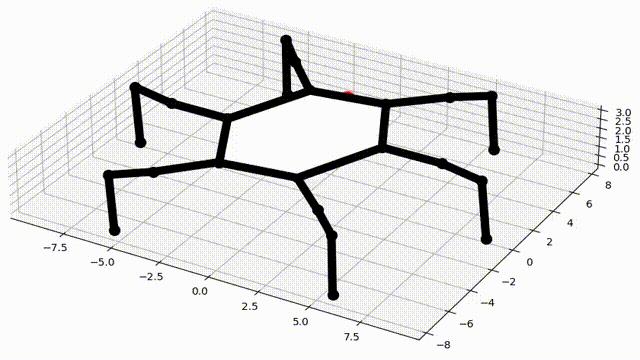
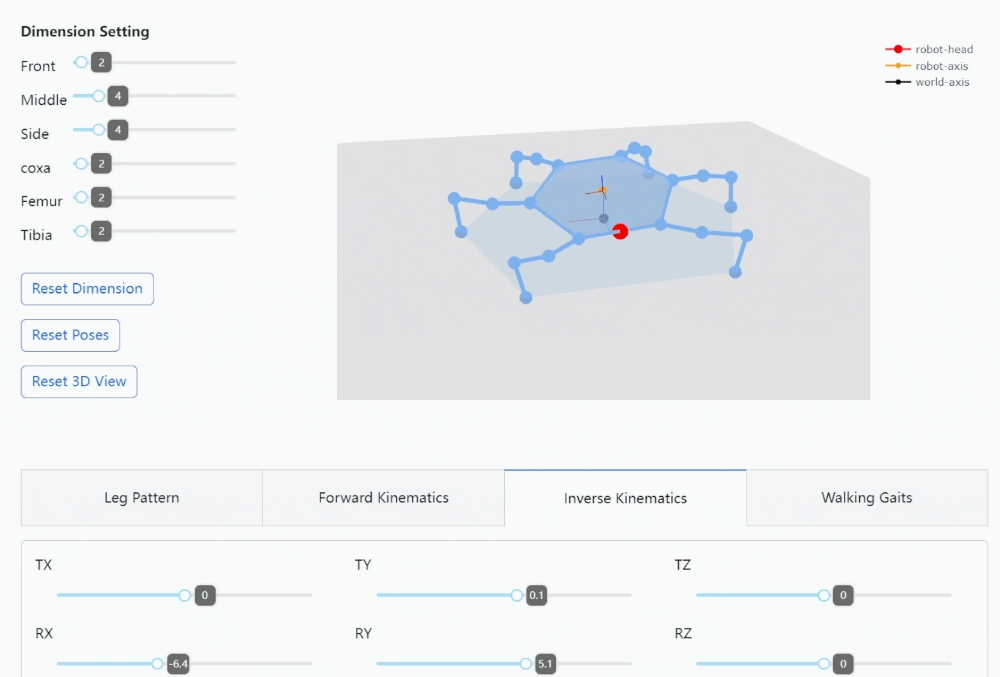

# Hexapod Robot Simulator

A simulator for hexapod **pose** and **gait** control based on *forward* and *inverse* kinematics.

|Dimension |Forward Kinematics 
--- | ---

|Inverse Kinematics |Walking Gait 
--- | ---

This project is implemented by Python with *numpy* for some matrix computations, *scipy.transforms* for 3D transformation, *dash* for user interface and interactive visualization, *matplotlib* for visualization/animation. 

### Tutorial
A [video tutorial](https://www.bilibili.com/video/BV1qF41167Sx) for building this project from scratch is available from [my channel](https://space.bilibili.com/13031745) on Bilibili (Chinese Language).

### How to use
+ just run the file `ui.py` and open on your browser, a web app will be hosted on http://127.0.0.1:8050, .
+ in `models.py`: you can run several visualizations/testings of the single models.
  + **Hexapod** 
    ```python
    if __name__ == "__main__":
      hexapod = Hexapod()
      fig1, ax1 = hexapod.visualize3d()
      hexapod.solve_ik([0, 6, 2], [0, 0, 0.2])
      print(hexapod.get_legs_pose())
      fig2, ax2 = hexapod.visualize3d()
      plt.show()
    ```
    This will print the leg positions (joint angles of each leg) of the hexapod:
    ```python
    {'MiddleRight': {'coxa': -92.09547174803812, 'femur': 6.36113571972891, 'tibia': -64.60434061668676}, 'FrontRight': {'coxa': -45.09639870158676, 'femur': 0.09531185287904773, 'tibia': -78.66206919332849}, 'FrontLeft': {'coxa': 45.10012726867826, 'femur': -12.077624233788663, 'tibia': -64.00686346144602}, 'MiddleLeft': {'coxa': 88.11133082594907, 'femur': -18.539795381247323, 'tibia': -49.1551576670496}, 'RearLeft': {'coxa': 130.89088550579493, 'femur': -11.540579859453953, 'tibia': -40.477079527074935}, 'RearRight': {'coxa': -139.3256544041924, 'femur': 0.7673781486253016, 'tibia': -44.45742377675202}}
    ```
    
    Two figures of the hexapod's initial pose and the changed pose will also be displayed:
    | | 
    --- | ---
    
  + **Legs**
    ```python
    if __name__ == "__main__":
      leg = Leg(lengths=[2,2,3])
      t = get_transformation_homo([0, 0, 45], [0,4,0])
      leg.change_pose([-60, 45, 30])
      leg.transform(t)
      fig, ax = leg.visualize3d()
      fig, ax = leg.visualizeAxis(fig=fig, ax=ax, scale=1)
    ```
    this will display the leg 3D positions and the local axis:
     |  
    ---|---
+ `animation.py`: run this file to display animation of the hexapod, followings are examples of tripod gait and IK:
     |  
    ---|---

### Issues
+ The angle range of every joint has not been limited, i.e., it can move from 0 to $2\pi$
+ In the inverse kinematics page, the solution may be wrong when it exceeds the allowed tilt range like:
  <!--  -->

  
  
  Currently I have yet got an efficient way to address this issue, do you have any good idea? 
+ Only Tripod gait has been implemented. Other gait will be realized in the [Webots project](https://github.com/XuelongSun/HexapodWebots): a simulated hexapod robot with physics engine.
+ Functions of some widgets (like the stance sliders in the IK tab) in the UI are not implemented. 

---

> This project is mainly inspired by [Mithi's Bare-Minimum Hexapod Robot Simulator](https://github.com/mithi/hexapod)

> This project is a good example of `learn by doing`, have fun!


